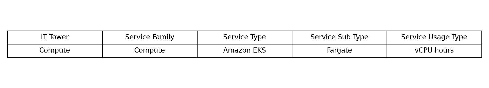
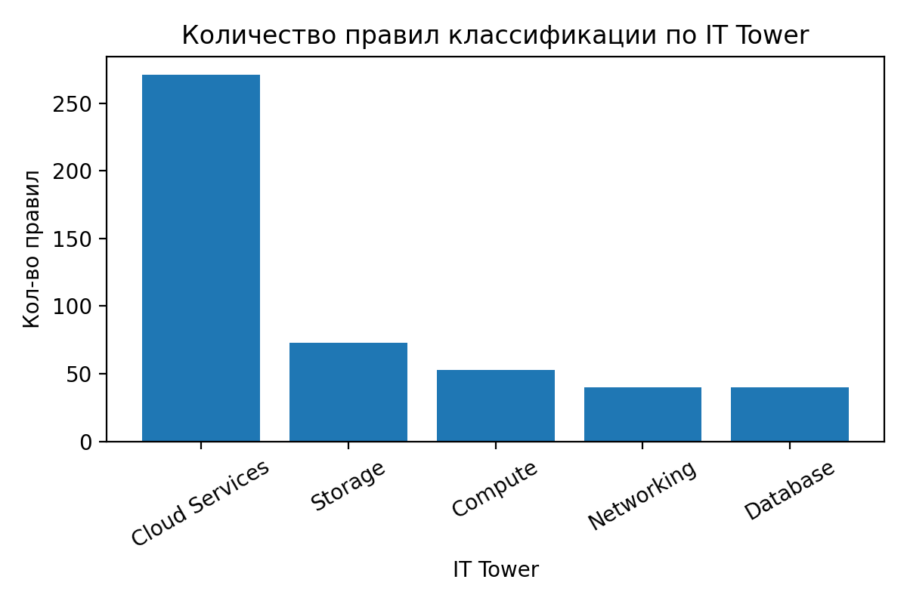

# Отчет по Облачной Лабораторной работе №1 "Знакомство с IaaS, PaaS, SaaS сервисами в облаке на примере Amazon Web Services (AWS). Создание сервисной модели."

**Выполнили: Ахмедов Бахадыр Мелихов Андрей Эль Хеннави Александр** 

## Цель работы
Знакомство с облачными сервисами и уровнями абстракции над инфраструктурой в облаке. Формирование понимания типов потребления сервисов (за что именно мы платим в облаке) и построение сервисной модели (Service Model) для дальнейшего анализа затрат в AWS.

## Алгоритм работы
1. Импортировать исходные данные биллинга (CSV-правила) в табличный редактор (Excel).
2. По каждой строке (правилу) сопоставить Product Code, Usage Type (SQL-паттерны с символом %), а также при наличии lineItem/Operation и lineItem/LineItemDescription с документацией AWS.
3. Заполнить классификацию в первых пяти колонках:
   - **IT Tower**
   - **Service Family**
   - **Service Type**
   - **Service Sub Type**
   - **Service Usage Type** (единица/тип потребления)
4. Сохранить итоговый файл и оформить отчет.

## Теория
Облачные технологии (Cloud Computing) - это модель предоставления вычислительных ресурсов через интернет по запросу и с оплатой по факту потребления.

**Преимущества облака:** гибкость, масштабируемость, доступность, безопасность, экономичность (pay-as-you-go).

Три базовые модели предоставления облачных услуг:
1. **IaaS** - Infrastructure as a Service (инфраструктура как услуга);
2. **PaaS** - Platform as a Service (платформа как услуга);
3. **SaaS** - Software as a Service (ПО как услуга).

### Что требуется в работе
В рамках лабораторной работы необходимо классифицировать строки потребления/правила биллинга по сервисной модели:
1. **Уровень абстракции** (IaaS/PaaS/SaaS - в виде понимания, какие сервисы относятся к какой модели);
2. **Функциональная категория** - IT Tower и Service Family;
3. **Сервис и тип потребления** - Service Type Service Sub Type, Service Usage Type (за что и в каких единицах происходит списание).

### Зачем это нужно
1. Для построения **сервисной модели** потребления облака;
2. Для **финансового анализа** (FinOps) и контроля расходов;
3. Для последующей оптимизации (поиск дорогих типов использования, неэффективных паттернов, резервирования и т.п.).

### Пример правила классификации
Ниже пример того, как одна строка входных данных (правило) сопоставляется с сервисной моделью:

## Практическая часть
### Исходные данные
Для выполнения работы использовался Excel-файл **LAB1.xlsx**, в котором:
- каждый входной CSV/набор правил вынесен на отдельный лист (листы 1–11);
- лист **Example** содержит примеры сопоставления для ориентира.

### Логика классификации
При заполнении классификации использовалась следующая последовательность:
1. **Product Code** - определение конкретного AWS-сервиса (например, AmazonEC2, AmazonS3, AmazonRDS).
2. **Usage Type** - распознавание паттернов (например, BoxUsage, TimedStorage, DataTransfer) и определение типа тарификации.
3. **Context / Description / Operation** (если заполнены) - уточнение подтипа и единиц потребления.
4. Заполнение иерархии: IT Tower   Service Family   Service Type   Service Sub Type   Service Usage Type.

## Результаты
В ходе работы заполнена сервисная модель для всех предоставленных правил (строк) биллинга AWS.

- **Всего правил классификации:** **477**
- **Уникальных сервисов (Service Type):** **77**
- **Уникальных Product Code:** **74**
- **Уникальных шаблонов Usage Type:** **248**

### Распределение по листам (наборам данных)
|   Лист (файл) |   Кол-во строк/правил |
|--------------:|----------------------:|
|             1 |                    40 |
|            10 |                    47 |
|            11 |                    43 |
|             2 |                    42 |
|             3 |                    43 |
|             4 |                    42 |
|             5 |                    44 |
|             6 |                    38 |
|             7 |                    53 |
|             8 |                    44 |
|             9 |                    41 |

### Распределение по IT Tower
| IT Tower       |   Кол-во правил |
|:---------------|----------------:|
| Cloud Services |             271 |
| Storage        |              73 |
| Compute        |              53 |
| Networking     |              40 |
| Database       |              40 |

Диаграмма распределения по IT Tower:

### Топ-10 Service Family по количеству правил
| Service Family           |   Кол-во правил |
|:-------------------------|----------------:|
| Storage&Content Delivery |              73 |
| Artificial Intelligence  |              61 |
| Analytics                |              55 |
| Application Services     |              55 |
| Compute                  |              51 |
| Networking               |              40 |
| Database                 |              40 |
| Security and Identity    |              30 |
| Management Tools         |              26 |
| Developer Tools          |              23 |

### Топ-10 Service Type по количеству правил
| Service Type                             |   Кол-во правил |
|:-----------------------------------------|----------------:|
| Amazon Simple Storage Service (S3)       |              53 |
| Amazon Elastic Compute Cloud (EC2)       |              29 |
| Amazon Simple Notification Service (SNS) |              18 |
| Amazon Redshift                          |              16 |
| Amazon Virtual Private Cloud (VPC)       |              14 |
| Amazon Route 53                          |              13 |
| Amazon Glacier                           |              12 |
| Amazon DynamoDB                          |              12 |
| Amazon Simple Notification Service       |              11 |
| Amazon Machine Learning                  |              10 |

## Заключение
Лабораторная работа выполнена: входные данные AWS были классифицированы и приведены к единой сервисной модели (IT Tower / Service Family / Service Type / Service Sub Type / Service Usage Type). Полученный результат подходит для дальнейшего анализа затрат и управления потреблением облачных сервисов AWS.

